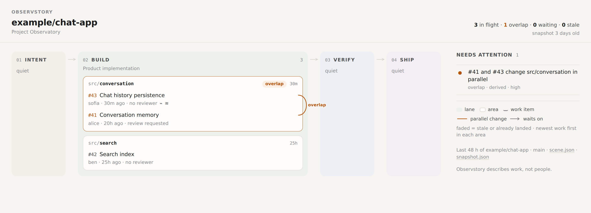

# Observstory

**Shared situational awareness for AI-assisted software work.**

When several people, each with their own coding agents, build in parallel, the work moves faster
than the team's shared picture of it. Overlaps and stalled work are discovered at merge time.
Observstory reads your repository's **in-flight work** (open PRs, unmerged branches, direct
pushes) and builds a typed, evidence-backed model of it. That model shows:

- **where** unmerged changes overlap
- **what** has stopped moving
- **what** is waiting on what

Humans get a dashboard. Coding agents query the same state before they act.



*The Project Map: calm map → where should we talk? → click for the evidence. [How to read it](docs/ui/project-map.md).*

**▶ [Try the Demo Lab](demo/index.html)**: one fictional project at nine moments, from quiet to overlap
to resolved, each rendered by the real pipeline. Open `demo/index.html` locally or on GitHub Pages.
*All demo data is synthetic.*

## Install (zero config)

```yaml
# .github/workflows/observstory.yml
name: Observstory
on:
  push:
  pull_request:
    types: [opened, synchronize, reopened, closed, ready_for_review, converted_to_draft]
  issues:
    types: [opened, closed, reopened]
  workflow_dispatch:
  schedule:
    - cron: "17 * * * *"   # reconciliation only; events are the primary trigger

permissions:
  contents: read
  pull-requests: read
  issues: read

jobs:
  observstory:
    runs-on: ubuntu-latest
    steps:
      - uses: actions/checkout@v4
      - id: observstory
        uses: blackmath88/observstory@main   # pin a release tag once one is published
      - uses: actions/upload-artifact@v4
        with: { name: observstory, path: observstory, retention-days: 7 }
```

Open the run's `observstory` artifact and load `index.html` (the Project Map; `radar.html` is the
radar view). **Without any config file** you get:

- areas derived from your paths
- default lanes (Intent, Build, Verify, Ship)
- in-flight work items
- the four signals below
- `data/snapshot.json` for agents, and `data/scene.json` (the map's visual contract)

The job summary lists the signals. For a hosted page, add the `configure-pages` /
`upload-pages-artifact` / `deploy-pages` steps (see [ARCHITECTURE.md](ARCHITECTURE.md#publishing)).
Think twice before doing that on a private repo: Pages may be more visible than the repo.

To name your own lanes, thresholds or ignore globs, add `observstory.config.json` (see
[`observstory.config.example.json`](observstory.config.example.json)). Every field is optional.

## What it shows: four signals, each with its evidence

| Signal | Question | Evidence | Basis |
|---|---|---|---|
| **overlap** | Is other unmerged work changing the same files as mine, in parallel? | Pairs of active work items (open PRs, branches without a PR, changes that landed on the default branch *after* the item diverged) that change a common file; merge-base evidence says why each pair counts as parallel | derived |
| **stale** | What has stopped moving? | Last commit or update time; branches without a PR say so | heuristic (threshold, default 72 h) |
| **waiting** | What can't land until something else lands? | PR stacked on another PR's branch; "Depends on #N" in the PR body | derived / declared |
| **burst** | Is this a machine-paced change stream? | ≥8 commits within 30 min; agent trailers make it high confidence | heuristic, used to fold the commit list |

Every signal carries `basis`, `confidence`, `evidence[]` (with GitHub URLs) and the `rule` with
its parameters. **Observed, derived and inferred are never mixed up.** See
[observable-signals.md](docs/discovery/observable-signals.md).

## Product vision

Observstory is also an experiment in **semantic UI compilation**: typed project state is compiled into task-specific, evidence-backed projections rather than rendered through one fixed dashboard. See [`docs/vision-semantic-ui-compiler.md`](docs/vision-semantic-ui-compiler.md).

## How it works

```text
GitHub events + hourly reconciliation
          │
          ▼
  collect  ──►  observations.json   facts: commits, PR files and commits, branch compares, issues
          │
          ▼
  derive   ──►  snapshot.json       typed state v1: work items · areas · lanes · signals · actors
          │     (pure function; schema-validated every run)
     ┌────┴─────┐
     ▼          ▼
 scene.json   observstory query …   (the MCP adapter wraps these same five queries)
     │        agents
 index.html  Project Map (humans) · radar.html (alternative view)
```

The typed model ([`schema/snapshot-v1.json`](schema/snapshot-v1.json)):

- **WorkItem**: a PR, a branch without a PR, or a direct-push stream
- **Area**: a path prefix, derived without config
- **Lane**: an optional semantic grouping of areas
- **Signal**, with its **Evidence**
- **Actor**: an author, with no counts attached
- **Commit** and **Issue**

## Optional: declared collaboration state (check-ins, gates, commitments)

For hackathons and fast teams: write check-in notes with a few markers, confirm them by name, and
commit them. The Project Map then shows a **mission rail** (NOW, the next gate, check-ins,
commitment due times) and **declared vs observed** cues next to the repository signals.

```text
- FREEZE src/core/ at Sat 12:00
- @Dana: evaluation set (by Sat 16:00) [evals/]
- DECISION: no cloud speech-to-text [src/transcribe/]
```

```bash
python3 scripts/observstory.py checkin propose notes.md --label "Kickoff" --at 2026-10-02T18:30:00Z   # -> PROPOSED
python3 scripts/observstory.py checkin confirm S1 --by Alice                                            # -> DECLARED
git add .observstory/coordination.json && git commit -m "Kickoff declarations"
```

A cue such as *"Freeze src/core/ at 12:00: src/core/ changed afterwards in #12"* names work, never
people. Nothing is recorded or transcribed, and nothing extracted counts until a person confirms
it. Without the file, nothing changes. Guide: [docs/collaboration-delivery](docs/collaboration-delivery/README.md).

## For coding agents

```bash
python3 scripts/observstory.py query work-near src/conversation/store.py --snapshot observstory/data/snapshot.json
# -> in-flight work touching that path, overlap signals with evidence, coordination_needed: true|false
```

The other queries are `changes-since <iso>`, `overlaps [path]`, `open-loops`, `handoff` and `coordination` (declared gates and commitments against the repository).
The contract is in [docs/demo/agent-contract.md](docs/demo/agent-contract.md).

**MCP is a delivery channel, not the product.** An MCP server would expose these same queries
over the same snapshot. It wouldn't collect data, call GitHub, or keep state of its own.

## Why GitHub (or GitHub Projects) doesn't already do this

GitHub shows *objects* (a PR, a branch) and *feeds*. GitHub Projects shows what people type into
cards. Neither computes the **relations between different authors' unmerged work**, and those
relations are the coordination state. IDE conflict tools compare *your* branch with main. Agent
orchestrators see *their own* sessions. Observstory is the project-wide, zero-maintenance view
that humans and agents share. More in
[competitive-landscape.md](docs/discovery/competitive-landscape.md).

## Not surveillance, by design

- Signals are about **areas and work items**, never people.
- No commit counts, line counts, rankings or per-person pages.
- Authors appear only as the people to talk to about a piece of work.
- These rules are enforced by tests (`tests/test_principles.py`) and by the schema: actor
  objects can't carry numeric fields.
- Only metadata is read. File contents are never stored. There is no LLM anywhere.

## Evidence that it works

- **Experiments:** 5+ signal experiments with fixtures, including a found and fixed false
  positive → [experiment-results.md](docs/development/experiment-results.md).
- **Demo:** the overlap emerges and then resolves → [docs/demo](docs/demo/README.md).
- **Self-observation:** running Observstory on its own repo caught a real ignore-pattern bug. It
  also produced 9 false overlaps, which led to base-aware overlap (issue #2) →
  [self-observation.md](docs/demo/self-observation.md).
- **Precision on real repositories:** 6 active OSS repos; 141 overlaps under v1 became 27, of which
  16 (59%) were judged useful → [precision-report.md](docs/development/precision-report.md).

```bash
python3 -m unittest discover -s tests -t .      # stdlib only, no install
```

## Documentation map

| Phase | Docs |
|---|---|
| Discover | [docs/discovery](docs/discovery/README.md): problem, landscape, failures, signals, scenarios, risks, opportunity map |
| Define | [docs/definition](docs/definition/README.md): thesis, JTBD, boundary, v1 scope, signal specs, principles |
| Develop | [docs/development](docs/development/): concept comparison, experiments, UI language · [prototypes/](prototypes/) |
| UI | [docs/ui](docs/ui/project-map.md): Project Map, scene grammar, design language · [prototypes/project-map](prototypes/project-map/) · [Demo Lab](demo/README.md) · [Semantic UI Playground](docs/ui/semantic-ui-playground.md) |
| Collaboration state (issue #7) | [discover](docs/collaboration-discovery/README.md) · [define](docs/collaboration-definition/README.md) · [develop](docs/collaboration-development/concept-comparison.md) · [deliver: guide](docs/collaboration-delivery/README.md) · [acceptance](docs/collaboration-delivery/acceptance.md) · [prototypes/collaboration](prototypes/collaboration/) |
| Deliver | [docs/demo](docs/demo/README.md) · [acceptance map](docs/demo/acceptance.md) · [ARCHITECTURE.md](ARCHITECTURE.md) · [DECISIONS.md](DECISIONS.md) · [ROADMAP.md](ROADMAP.md) |
