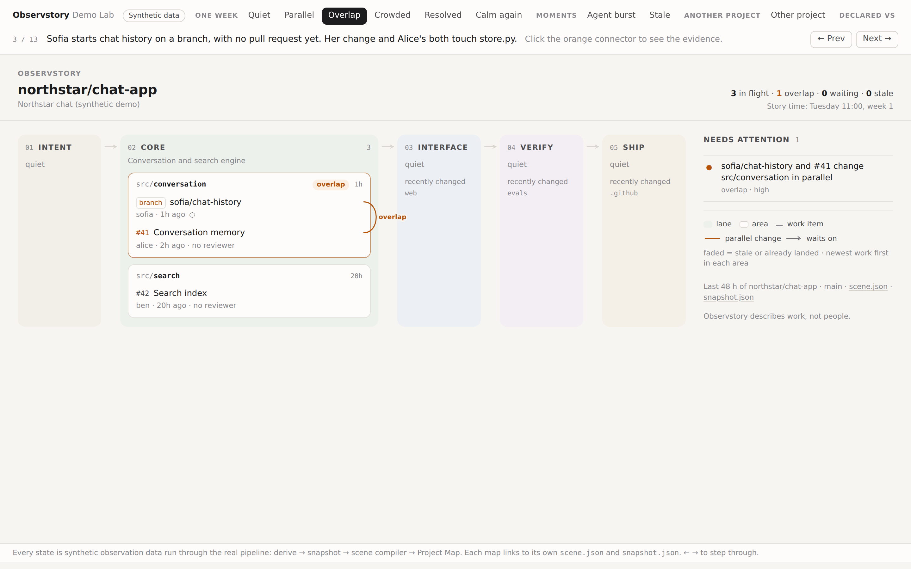
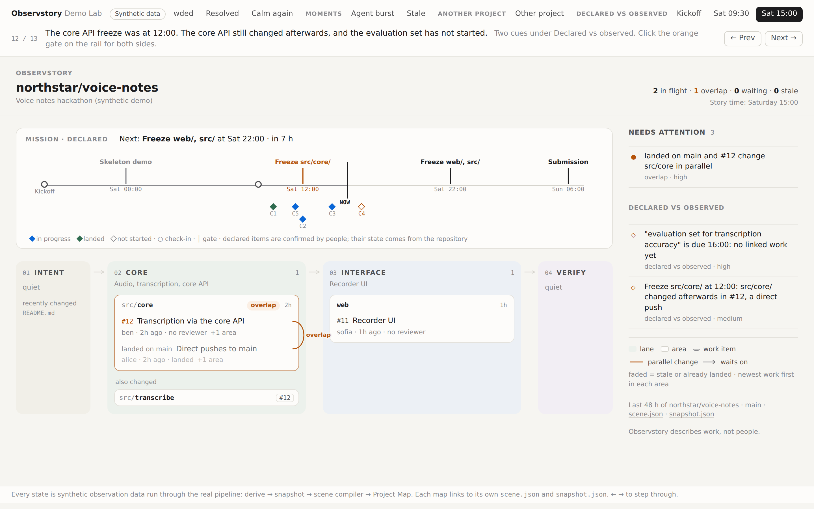

# Observstory Demo Lab

**One project. Different moments. The map tells the story.**

Open [`index.html`](index.html) in a browser. There's no server, no network and no GitHub account
involved. Step through with the tabs, **← Prev / Next →**, or the arrow keys. Each state has its own
address (`index.html#overlap`).

> **All data here is synthetic.** `northstar/chat-app`, `northstar/recsys` and `northstar/voice-notes`
> are invented repositories, and Alice, Ben, Sofia and Dana are invented people. The data links nowhere.



## The states

| # | State | What happens | What to notice |
|---|---|---|---|
| 1 | Quiet | Monday morning; recent work has landed | Calm: lanes, and what changed recently |
| 2 | Parallel | Alice, Ben and Sofia open PRs in three different areas | Nothing asks for attention |
| 3 | Overlap | Sofia starts chat history on a **branch with no PR**; she and Alice both touch `store.py` | The orange connector. Click it for the evidence |
| 4 | Crowded | Sofia's PR and Ben's agent-assisted refactor both rewrite `store.py` | Three overlaps on one file; Ben's export shares the area but no file, so it gets no connector |
| 5 | Resolved | Sofia moves to evaluating Alice's work (declared dependency); Ben stacks his refactor on Alice's branch | The overlap is gone; grey "waits on" arrows appear |
| 6 | Calm again | The memory work and the refactor land | Quiet again |
| 7 | Agent burst | 24 agent commits in under an hour | Folded into one PR with a small ≋, kept in the background |
| 8 | Stale | The next week: a spike branch with no PR and a parked draft | Open loops, described as work, not people |
| 9 | Other project | `northstar/recsys` with Data → Pipeline → Model → Eval → API → Docs | The same renderer; the lanes come from configuration |

### Act 4: declared vs observed (issue #7)

A 36-hour hackathon, `northstar/voice-notes`. Check-in notes go through the real extractor and a
named confirmation (`fixtures/collab_lab.py`); each moment only sees check-ins that had happened by then.

| # | State | What happens | What to notice |
|---|---|---|---|
| 10 | Kickoff | Gates and commitments agreed; Alice confirms the notes | The mission rail: NOW, the next gate, due-time diamonds with no work yet |
| 11 | Sat 09:30 | Alice's pipeline landed; the morning check-in links a commitment to #12 | Commitment states come from the repository |
| 12 | Sat 15:00 | The core API changed after its 12:00 freeze; the evaluation set hasn't started | Two cues under **Declared vs observed**; click the orange gate for both sides |
| 13 | Sat 23:00 | The feature freeze passed with the recorder PR open; evening notes are only proposed | Proposed items are counted, never drawn |



## How it's made

```text
fixtures/demo_lab.py  →  fixtures/demo-lab/<state>.json   (synthetic observation bundles)
        ↓ derive (the real engine)
    snapshot  →  map compiler  →  scene  →  Project Map renderer   →  demo/states/<state>.html
                                                                  →  demo/index.html (the shell)
```

- **Nothing on these pages is hand-drawn.** Every map is the real Project Map, compiled from observation data by the same code the GitHub Action runs. Each page links to its own `scene.json` and `snapshot.json`.
- **The shell is small.** It's about 100 lines of HTML, CSS and JavaScript around an iframe: tabs, a one-line caption and Prev/Next. Switching states loads a different generated page. The map isn't re-implemented in the browser.
- **Story time is fixed.** Instead of "snapshot N hours old", each map shows the in-story time (e.g. *Tuesday 11:00, week 1*).

Rebuild after changing the engine, the renderer or the story:

```bash
python3 fixtures/demo_lab.py        # regenerate the synthetic observations
python3 fixtures/collab_lab.py      # ... and the hackathon (declarations + moments)
python3 demo/build.py               # derive, compile and render every state, write the shell
python3 demo/build.py --shots       # also refresh docs/demo/img/demo-lab-*.png (needs Playwright)
python3 -m unittest tests.test_demo_lab
```

## Hosting

The folder is plain static files. With GitHub Pages (Settings → Pages → *Deploy from a branch* →
`main` / root), the demo is served at `https://<owner>.github.io/<repo>/demo/`. Any static host
works the same way.
