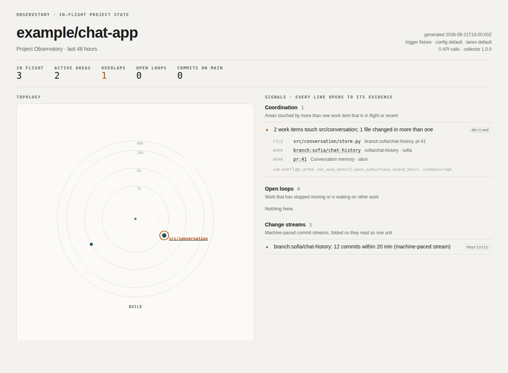
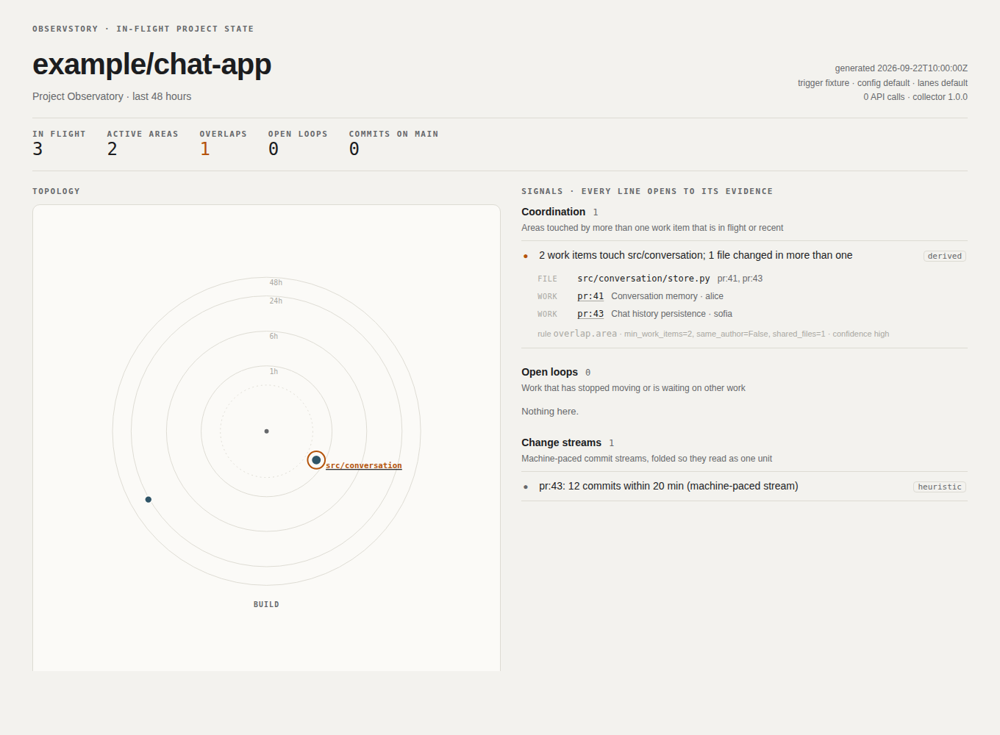
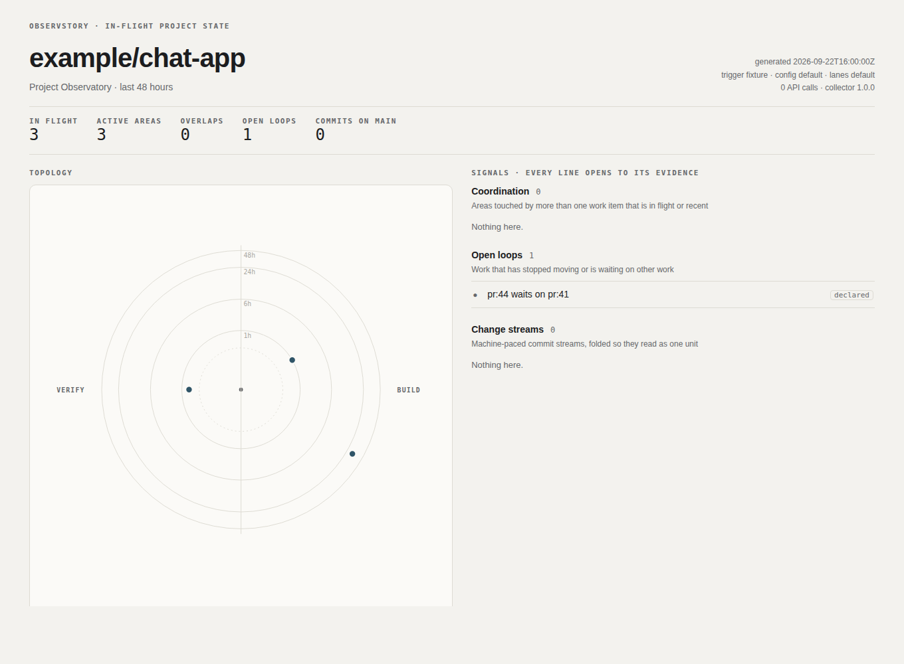
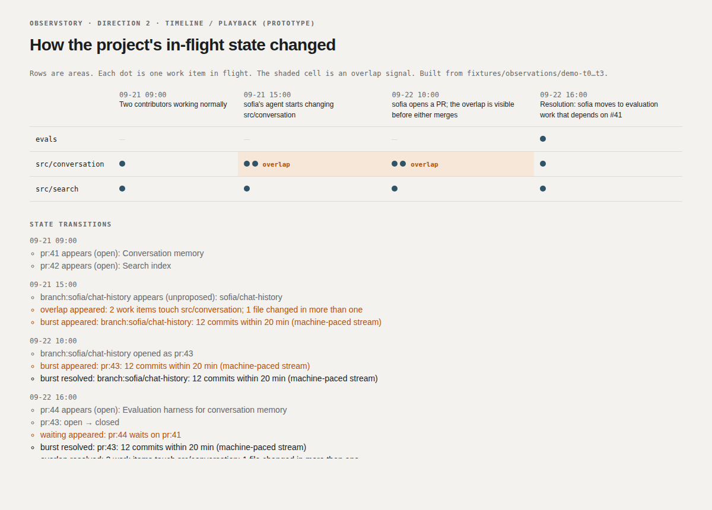

# Demo: making coordination necessary earlier

A reproducible end-to-end scenario. Every frame is derived from an observation bundle in
`fixtures/observations/demo-t*.json` by the same code the Action runs.

```bash
python3 prototypes/radar/build.py          # dashboards for each moment
python3 prototypes/timeline/build.py       # playback + transitions
python3 prototypes/agent-surface/build.py  # what an agent sees at t2
python3 -m unittest tests.test_signals.DemoScenario
```

## Before (Mon 09:00): two contributors working normally
alice opens **#41 Conversation memory** (`src/conversation/`). ben opens **#42 Search index**
(`src/search/`). The radar shows two areas in the Build lane. No signals.

## Development (Mon 15:00): parallel work starts in the same subsystem
sofia asks her coding agent to add chat history. The agent works in a worktree and pushes
`sofia/chat-history`: 12 commits in 20 minutes, touching `src/conversation/history.py` and
`src/conversation/store.py`. **There is no PR yet.** GitHub's PR list still shows two PRs, and
nothing there connects sofia's branch to alice's.

Observstory, on the next push event:
- `overlap:src/conversation`: **confidence high, basis derived**. Evidence: `store.py` is changed
  by both `pr:41` and `branch:sofia/chat-history`.
- `burst:branch:sofia/chat-history`: a machine-paced stream with a declared agent trailer, folded
  into one line.



## Observstory (Tue 10:00): the overlap is visible before either change merges
sofia opens **#43**. The overlap persists under the same stable id (it's keyed by area). A
coding agent that asks `work_near(["src/conversation/store.py"])` gets both PRs, the shared file
and `coordination_needed: true` (see [agent-contract.md](agent-contract.md)).



## Resolution (Tue 16:00): one contributor moves to evaluation
alice and sofia talk. sofia closes #43 and opens **#44 Evaluation harness for conversation
memory** (`evals/conversation/`), writing *"Depends on #41"* in the description.

- The overlap resolves.
- `waiting:pr:44:pr:41` appears: **basis declared**, taken from the PR body.
- Declaring the dependency is also how the team *acknowledges* shared ground (ADR-014).



## Result


Observstory didn't decide whose approach was right, rank anyone, or summarise code with a model.
It made one fact visible from the first push of the second branch, not at merge time: two
unmerged changes were modifying `store.py`. What to do about it stayed a human conversation.

## Self-observation
See [self-observation.md](self-observation.md): Observstory run against its own repository
during this work.
