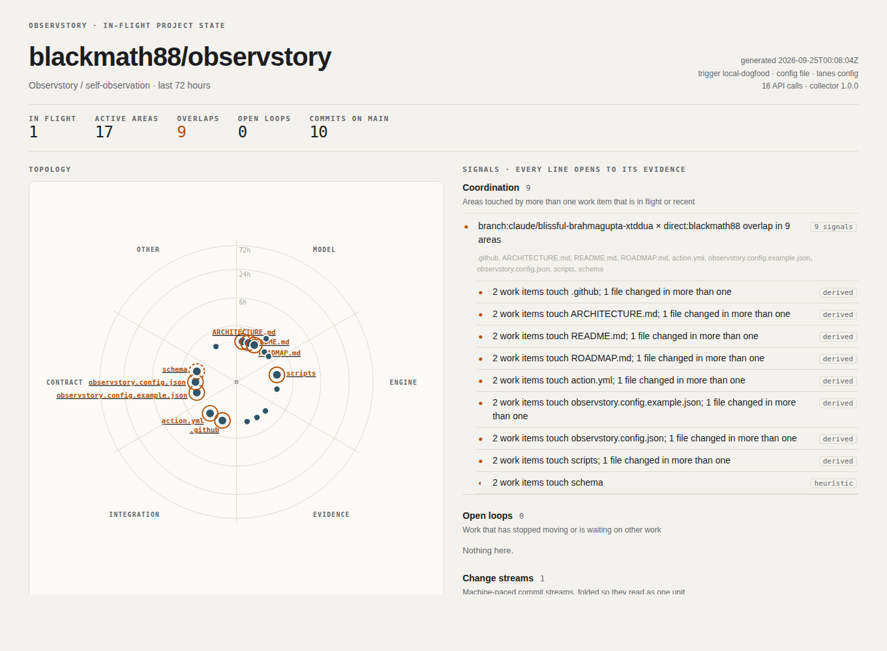

# Self-observation

Observstory was run against **its own live repository** while this v1 work was in progress,
reading the real GitHub API.

- Command: `OBSERVSTORY_REPOSITORY=blackmath88/observstory python3 scripts/observstory.py build`
- Config: [`observstory.config.json`](../../observstory.config.json) (5 lanes: Model, Engine, Evidence, Integration, Contract)
- Output: [`self/index.html`](self/index.html), [`self/data/snapshot.json`](self/data/snapshot.json), [`self/data/observations.json`](self/data/observations.json)
- Cost: 16 API calls, no degradation



## What it saw

| Snapshot fact | Is it true? |
|---|---|
| 1 work item in flight: `branch:claude/blissful-brahmagupta-xtddua`, state **unproposed** (no PR) | Yes. The v1 work was pushed to a branch with no PR open |
| `direct:blackmath88`: the maintainer's direct pushes to `main` in the window | Yes. The v0 commits |
| **9 overlaps**, high confidence, between the branch and those pushes: README, ARCHITECTURE, ROADMAP, action.yml, the dogfood workflow, scripts, config, schema | Yes. v1 rewrites exactly those files. Anyone else editing them in parallel should talk to whoever owns this branch first |
| `burst` on `direct:blackmath88`: 10 commits within 10 min | Yes. The v0 history landed as a rapid sequence of commits |
| The branch is marked **agent-assisted (declared)** | Yes, from the `Co-Authored-By: Claude` trailers |
| Open loops: none | Correct. Nothing is idle for more than 72 h, and nothing is stacked |

## What dogfooding found (and fixed)

1. **A real bug.** The default ignore entry for the output folder (`observstory/`) matched *any*
   directory with that name, so `src/observstory/` (the whole engine) was silently dropped from
   the model. Fixed with gitignore-style anchoring (`/observstory/`). Regression test:
   `test_anchored_ignore_does_not_hide_nested_dirs`.
2. **Radar legibility on real timing.** All real activity was less than an hour old, so a linear
   recency axis stacked every mark at the centre. Changed to a log scale with an inner band,
   labels only on overlap or busy areas, and collision nudging.
3. **Signal fatigue.** One relationship (branch × push stream) produced 9 per-area signals. The
   dashboard now groups overlaps with the same work-item set into one entry. The snapshot keeps
   per-area signals, so agents can still query by path.

## Reproduce

```bash
OBSERVSTORY_REPOSITORY=blackmath88/observstory OBSERVSTORY_OUTPUT=/tmp/obs \
  python3 scripts/observstory.py build        # token optional for public repos (60 req/h)
python3 scripts/observstory.py query work-near README.md --snapshot /tmp/obs/data/snapshot.json
```

In CI, `.github/workflows/observstory.yml` runs the same thing on every push, PR and issue event,
and hourly, after running the test suite.
