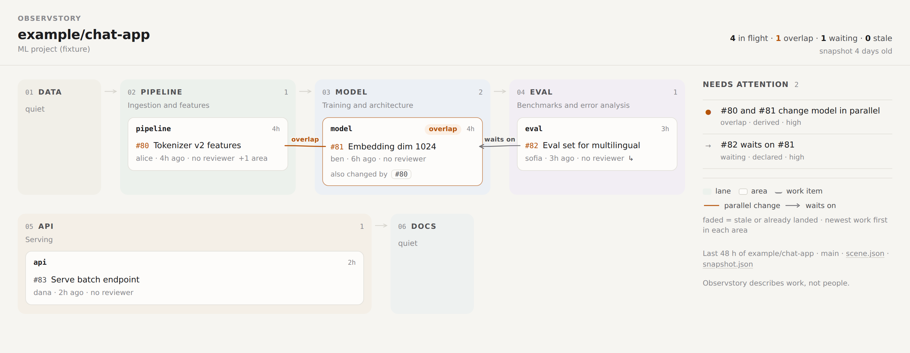
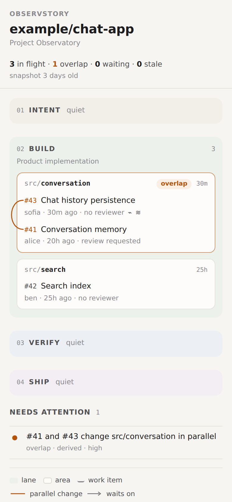

# Project Map

**Calm project map → where should we talk? → show me the evidence.**

The Project Map is Observstory's default human view (`observstory/index.html`). The radar is
still generated as an alternative projection (`observstory/radar.html`).


## Reading it in ten seconds

| Question | Where the answer is |
|---|---|
| What are the major parts of this project? | The **lanes**, left to right in their configured order, with thin arrows showing the flow |
| What is in flight? | The **cards**: each card is an area; each row is a work item (a PR, a branch, or a change that landed on the default branch). Newest first, with its age |
| Where is coordination needed? | Anything in **orange**: the connector between two work items, the area's `overlap` pill, and the **Needs attention** column. Orange is used for nothing else |
| What depends on something else? | Grey **arrows labelled "waits on"**, pointing at the change being waited for |
| What should I click? | Any row, area header, connector or attention item opens the **inspector** with the evidence |

## Layout grammar (constrained, not force-directed)

```text
┌ 01 INTENT ┐ → ┌ 02 BUILD ──────────────────┐ → ┌ 03 VERIFY ─────────┐ → ┌ 04 SHIP ┐
│ quiet     │   │ ┌ src/conversation  overlap ┐ │   │ ┌ evals ──────────┐ │   │ quiet   │
│           │   │ │ #43 Chat history        ─╮│ │   │ │ #44 Eval harness │ │   │         │
│           │   │ │ #41 Conversation memory ─╯│◄├───┼─┤    waits on      │ │   │         │
│           │   │ └───────────────────────────┘ │   │ └─────────────────┘ │   │         │
│           │   │ ┌ src/search ───────────────┐ │   └─────────────────────┘   └─────────┘
│           │   │ │ #42 Search index          │ │
└───────────┘   └─────────────────────────────┘
```

- **Lanes flow and wrap.** Active lanes share the row; quiet lanes shrink to a slim column. With six or more lanes the row wraps, and arrows are drawn only between neighbours on the same row. On phones everything stacks vertically.
- **Areas are cards and work items are rows.** A work item is drawn once, in the area where it changes the most. Other areas it touches show a compact "also changed" line that links back to it. More than five rows in an area, or more than four reference lines in a lane, collapse behind "N more".
- **Connectors follow the layout.** HTML/CSS decides where cards land; a small script measures them and draws SVG connectors, and redraws on resize or expand.
  - Within an area: a bracket (flipped to the left when there's no room on the right).
  - Across lanes: a horizontal curve.
  - Across wrapped rows: a vertical curve.
  - Confidence is shown by the stroke: solid for high, dashed for medium, dotted for low.
- **Time without a radar.** Newest work sits at the top of each area, every row and area shows its age, and stale or landed work fades back.

## Interaction

- **Hover or focus** shows the full title.
- **Click, or Enter/Space**, on a row, an area header, a connector or an attention item opens the inspector.
  - Selection is persistent (a blue outline).
  - Related work stays; unrelated work dims.
- **The inspector** is a right-hand panel on desktop and a bottom sheet on phones.
  - Work item: state, review state, authors, age, lane and area, merge base, burst, relationships, files changed.
  - Area: its work items, the parallel changes there, their evidence, and files in flight.
  - Connector: both work items with links, shared files, basis, confidence, the rule and its parameters, and every evidence entry (including why the pair counts as parallel).
- **Escape** closes the inspector and returns focus to where you were. Nothing animates except the panel sliding in, and that stops under `prefers-reduced-motion`.
- **Without JavaScript** the map, the lanes, the cards and the attention list still render. Only the connectors and the inspector need the script.

## Dense maps

Real repositories have 50 items in flight, and one change can overlap a dozen others. A connector is
drawn only when it can be read:

- **Busy cards get a count, not a fan.** A card with more than 3 relations shows `×N` in accent.
  Its connectors are drawn when the card, or one of its relations in "Needs attention", is selected.
- **Collapsed work is bundled.** A relation with an end inside a closed "N more" is not drawn to a
  hidden card. Within one area, the summary counts it ("28 more · 16 relations"). Across areas,
  one dashed line per pair of visible anchors carries `×n`, and clicking it opens the group.
  Selecting a relation opens whatever holds its ends.
- **Nothing is dropped.** Every relation stays in "Needs attention" and in the inspector, and the
  scene is unchanged: this is a renderer rule only.

Measured with `node prototypes/project-map/measure-wires.js <pages>`: the most connectors meeting at
one point went from 13 (uv), 7 (astro), 6 (vite) and 5 (tldraw) to at most 3. Designed states,
where no card has more than 3 relations, draw exactly what they did before (a test holds that).

## Demo Lab

[`demo/index.html`](../../demo/index.html) walks through one synthetic project, `northstar/chat-app`,
at nine moments, each compiled by the real pipeline. See [demo/README.md](../../demo/README.md).

## Scenarios (all compiled from fixtures, `prototypes/project-map/`)

| Page | Shows |
|---|---|
| `demo-t0` … `demo-t3` | The demo story: normal work, the overlap emerging, visible before merge, resolved into a waiting relationship |
| `crowded-area` | Three overlaps in one area (nested brackets, one label) |
| `ml-project` | Six custom lanes (Data → Pipeline → Model → Eval → API → Docs) with no renderer changes |
| `long-labels` | 200-character titles, deep paths, a long branch name |
| `stale` | Stale work and a branch without a PR, faded and listed under attention |
| `quiet` | Nothing in flight |
| `self` | Observstory's own repository |



