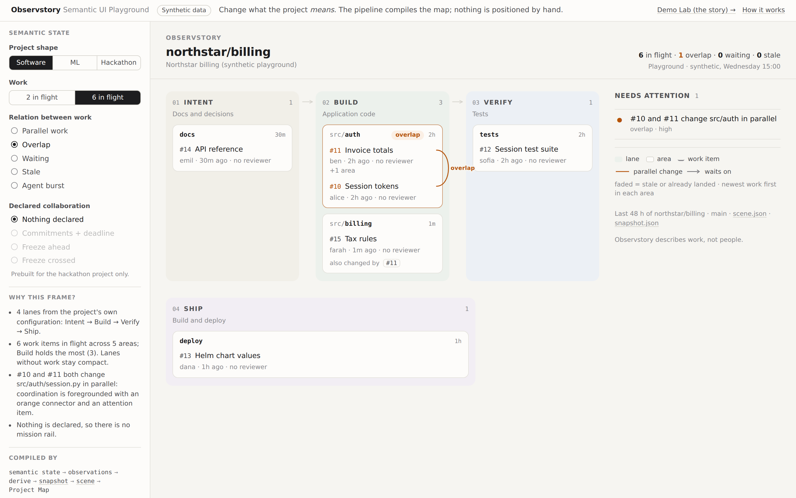
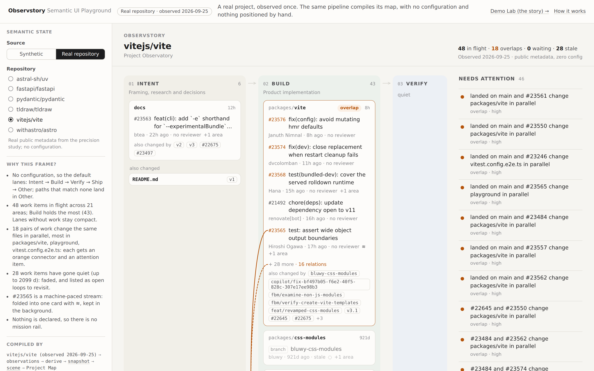

# Semantic UI Playground

> **I am changing the semantic state, not the layout. The interface is compiled from that state.**

Open [`demo/playground.html`](../../demo/playground.html). No server or network is needed; the data is synthetic.



## 1. What it demonstrates

The Demo Lab ([`demo/index.html`](../../demo/index.html)) is a **narrated sequence** of states.
The playground is an **interactive proof** that semantic state drives composition, and that the same compiler holds up on real repositories. You choose
what the project *means*, and the real pipeline produces the map:

| Control | Semantic meaning | What the compiled map does |
|---|---|---|
| Project shape: Software / ML / Hackathon | which lanes the project declares in its config | Intent → Build → Verify → Ship becomes Data → Pipeline → Model → Eval → API → Docs; cards move to the lanes their paths belong to |
| Work: 2 / 6 in flight | how much unmerged work exists | areas appear, lanes fill or stay compact, cards group per area |
| Relation: parallel / overlap / waiting / stale / agent burst | how the second piece of work relates to the first | nothing asks for attention · an orange connector plus an attention item · a grey directed arrow · a faded card and an open loop · a folded ≋ card |
| Declared collaboration: none / commitments / freeze ahead / freeze crossed | what the team confirmed at a check-in | no rail · a mission rail with commitments · a rail with the next gate · a rail plus a "declared vs observed" cue |

Next to the map:

- **Why this frame?** A few sentences such as "#10 and #11 both change src/auth/session.py in
  parallel: coordination is foregrounded". They come from `map_compiler.explain_frame(scene)`,
  a small deterministic function that reads only the compiled scene, so the explanation can't
  disagree with the picture.
- **Recompiled:** what changed from the previous state, e.g. `overlaps 0→1 · attention 0→1` or
  `mission rail off→on`. It compares the two generated scenes.
- **Compiled by:** the chain from semantic state to Project Map, with links to this state's
  `snapshot.json`, `scene.json` and generated page, plus an inline scene excerpt. Inside the map,
  every connector, card and cue still opens the inspector with its evidence.

## 2. Why there are semantic controls but no layout controls

The controls choose facts about the project: its shape, its volume of work, a relation, a
declaration. There is no control for position, size, color, lane order, card placement or
connector geometry. That is the claim being tested, not a missing feature. If a user could drag
a card, the map would stop being evidence of the project's state. The shell's tests check that
there are no range, number or color inputs.

## 3. How a state flows through the real pipeline

```text
semantic controls / project state
              ↓
     synthetic observations
              ↓
           derive
              ↓
           snapshot
              ↓
       semantic compiler
              ↓
          scene-v1
              ↓
      Project Map renderer
```

- `fixtures/playground.py` turns a spec `{shape, relation, volume, collab}` into an observation
  bundle, using the Demo Lab's `Repo` helper. Declared states go through the real check-in
  extractor and a named confirmation (`coordination.propose` and `confirm`).
- `demo/build_playground.py` runs each spec through `derive` → `compile_scene` → `render_map`,
  validates the snapshot and scene, and writes `demo/playground/<state>.{html,scene.json,snapshot.json}`.
  It then writes `demo/playground.html`: the controls, a manifest of the states, and an iframe.
- The browser holds **no Observstory semantics**. It maps the control values to a state id
  (`hackathon.overlap.low.conflict`) and loads that generated page. Everything it shows comes from
  the build: the explanation, the scene excerpt and the "recompiled" comparison.

### The state matrix

The build doesn't generate every combination. It prebuilds a small matrix of 42 states:

- Software, ML and Hackathon × 5 relations × 2 volumes, with nothing declared (30).
- Hackathon × {commitments, freeze ahead, freeze crossed} × {parallel, overlap} × 2 volumes (12).

Declared collaboration is only prebuilt for the hackathon project, where check-ins and gates
belong. It is shown with calm and with overlapping work, which is enough to show a cue appearing
next to, and independently of, a repository signal. An option is disabled only when no state
exists for it under the current shape. Choosing a collaboration state while "waiting" is
selected resets the relation to parallel, and a note says so.

Relations are a single choice, not independent checkboxes. Each one is expressed by the second
piece of work relative to the first, so the change in the map can be attributed to one semantic
change. Two volume steps stand in for a slider; each extra step would add another full copy of
the matrix.

Rebuild with `python3 demo/build.py` (Demo Lab and playground) and check with
`python3 -m unittest tests.test_playground`. The tests confirm that each relation produces its
edge or card state in every shape and volume, that the rail appears exactly when something is
declared, that the stored scenes match a fresh build, and that the explanations never name a person.

## Real repositories

**Source → Real repository** swaps the four semantic controls for a picker of six real public
repositories (`astral-sh/uv`, `fastapi/fastapi`, `pydantic/pydantic`, `tldraw/tldraw`,
`vitejs/vite`, `withastro/astro`). Their observation bundles are the ones collected with git
only for the [precision study](../development/precision-report.md) (`evals/precision/data/`, 2026-09-25).
Each goes through the same `derive` → `compile_scene` → `render_map` with **no configuration**,
at its own fetch time, so the map shows what was true then, not today. The header, the map and
"Compiled by" all say *Real repository · observed 2026-09-25*. Nothing is edited or invented.



This is the part synthetic states can't show: the compiler meeting paths nobody designed for it.
What it showed:

| Repository | In flight | Overlap pairs | Waiting | Stale | Busiest lane |
|---|---|---|---|---|---|
| astral-sh/uv | 49 | 50 | 6 | 19 | Other (36) |
| fastapi/fastapi | 32 | 0 | 0 | 31 | Other (22) |
| pydantic/pydantic | 48 | 0 | 1 | 43 | Other (39) |
| tldraw/tldraw | 49 | 23 | 2 | 24 | Build (42) |
| vitejs/vite | 48 | 18 | 0 | 28 | Build (43) |
| withastro/astro | 47 | 21 | 1 | 31 | Build (39) |

- **Default lanes fit JavaScript monorepos, not Python or Rust packages.** `packages/` lands in
  Build, but `fastapi/`, `pydantic/` and `crates/` fall into Other, which then holds most of the
  work. "Why this frame?" says so plainly ("No configuration, so the default lanes … paths that
  match none land in Other"), and a one-line `observstory.config.json` fixes it. Whether the
  defaults should learn a package's own top-level directory is an open question, not decided here.
- **Fixed: connectors fanned out of dense cards.** Two causes, measured with
  `prototypes/project-map/measure-wires.js`. First, a card inside a closed "N more" still reports a
  layout box in current Chromium, so lines were drawn to where nothing is shown (49 of uv's 56
  overlaps end on a collapsed card). Second, hubs: one change overlapping many others (uv #21951: 13).
  See ADR-033 and [project-map.md](project-map.md#dense-maps). Up to 13 connectors used to meet at
  one point; now at most 3 do.
- **Fixed:** stale work that only changed ignored files (a changeset, an empty PR) has no card.
  The compiler used to list it as attention pointing at nothing, which made fastapi and astro fail
  scene validation. It now leaves it to the snapshot, where agents still see it.
- **Fixed:** "Why this frame?" produced one sentence per relation (50 on uv). It now summarizes
  when there are more than two relations or three stale items, and breaks ties by name so the
  text is the same in every process.

`blackmath88/observstory` itself isn't included: only a stored snapshot exists for it, with no
observation bundle to derive from, and the playground only shows states that go through `derive`.

Overlap pairs are edges on the map (two pieces of work sharing a file). The precision report
counts overlap *signals* per area, so the two numbers differ.

## 4. Relation to the vision

[`docs/vision-semantic-ui-compiler.md`](../vision-semantic-ui-compiler.md) argues that the shape
of the interface should follow the shape of the project, and that the semantic layer decides
*what exists and matters* while the renderer decides *placement, spacing and geometry*. The
playground makes that claim testable in a few clicks: the only inputs are semantic, and every
visible change is produced by `compile_scene` and `render_map`. The "Why this frame?" block is a
small instance of the vision's principle that users should be able to see why the interface
looks the way it does.

## 5. What is deterministic today

Everything. The fixtures, `derive`, reconciliation, `compile_scene`, `explain_frame` and
`render_map` are pure functions, and the committed pages are byte-for-byte reproducible from the
specs. There is no LLM and no browser-side inference. The frame is chosen by fixed rules: lanes
come from configuration, attention comes from signals, and the rail comes from declarations.

## 6. Where a `FrameIntent` layer could sit

Today, "which frame?" is implicit in `compile_scene` (e.g. overlap → foreground coordination).
If frames ever need to vary for the same state (for a reviewer, an agent handoff, or a freeze
window), an explicit, typed `FrameIntent` would sit between the snapshot and the compiler:

```text
snapshot ──► FrameIntent { focus, foreground[], collapse[], reason } ──► compile_scene ──► scene-v1
                ▲
     deterministic rules today; optionally a model that only *proposes* an intent
```

It would be inspectable and reversible, like declared state: `explain_frame` would read its
`reason`, and the scene grammar would stay bounded. It isn't built, because the playground doesn't
yet show a need: one state compiles to one useful frame.
